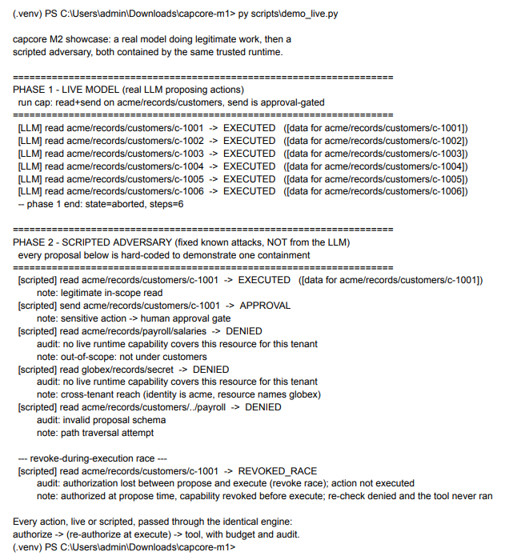
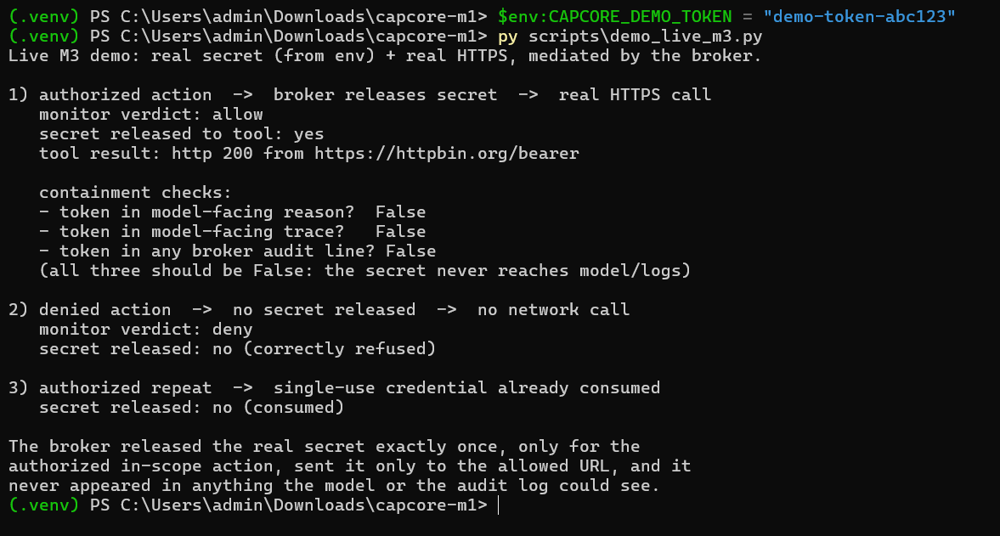
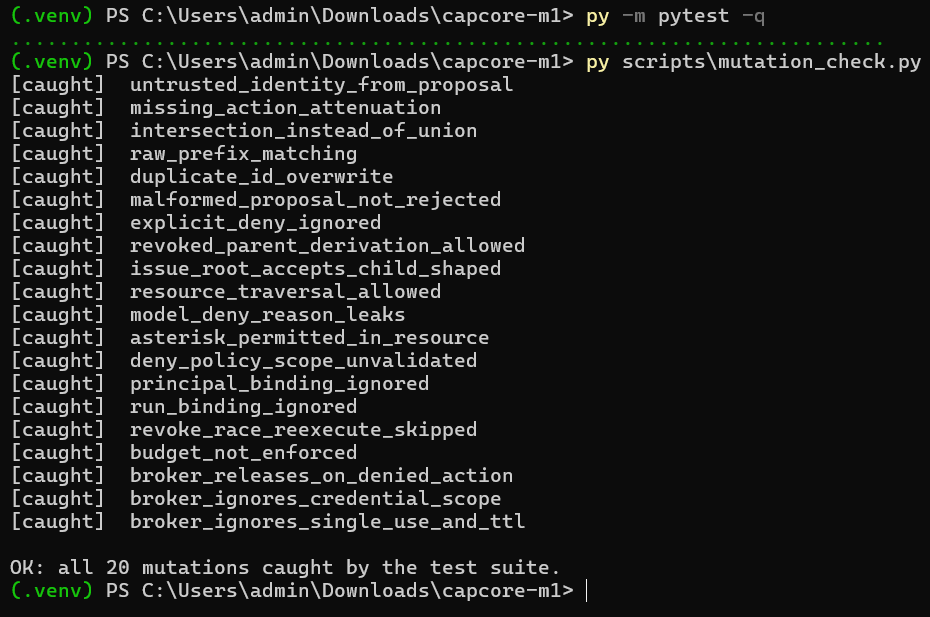

# capcore

[](https://github.com/tgandhle/capcore-m1/actions/workflows/ci.yml)

**A capability-enforced runtime for LLM agents.** An untrusted model proposes
actions; a deterministic reference monitor outside the model decides whether each
one is allowed, gated for human approval, or denied. Deny is the default. The
security guarantee does not depend on the model cooperating.

**Status: Partial.** M1 (capability core), M2 (execution loop), and M3
(credential broker) are implemented and tested. Open items are listed below and
tracked honestly in [`capcore/MODEL.md`](capcore/MODEL.md).

---

## It actually runs

### A real LLM, contained

A local model (llama3.2 via Ollama) proposes real actions into the runtime. The
in-scope reads execute. Then a scripted adversary phase (clearly labeled, so the
demo does not pass scripted attacks off as model output) drives the containment
cases: an out-of-scope read, a cross-tenant reach, a path-traversal attempt, and
an action that is authorized and then has its capability revoked *before it
executes*, which the engine stops. Both phases run through the identical engine.



`python scripts/demo_live.py` (needs Ollama)

### A real secret, contained

The credential broker releases a real token (read from an environment variable,
never committed) *only* for the authorized action, and the tool sends it only to
its allowed endpoint, a real HTTPS call that returns 200. The token is provably
absent from every model-facing reason, every trace, and every audit line. The
denied action gets nothing. The single-use credential is consumed and the
authorized *repeat* gets nothing either.



`python scripts/demo_live_m3.py`

### The tests have teeth

73 tests pass. More importantly, **all 20 mutations are caught**: each mutation
reintroduces a specific known defect (confused deputy, missing attenuation,
prefix confusion, fail-open deny policy, ignored run binding, skipped
revoke-race re-check, unenforced budget, broker releasing on a denied action...)
and the suite is asserted to *fail*. A test suite that passes proves little; a
suite that provably catches every known bug proves something.



`python scripts/mutation_check.py` (mutates a temp copy, never your working tree)

---

## The idea

LLM agent security is often enforced by asking the model nicely: system prompts,
fine-tuning, refusal training. Those are probabilistic and the model is the thing
you do not trust. capcore puts the enforcement *outside* the model, in
deterministic runtime policy:

- **Identity is trusted, proposals are not.** A `RunContext` (tenant, principal,
  run) comes from the runtime. A `Proposal` (resource, verb) comes from the model
  and is treated as hostile input. The monitor never derives identity from the
  proposal, that is the confused-deputy defect, and it is mutation-tested.
- **Capabilities bind and attenuate.** A capability grants specific verbs on a
  specific resource scope, bound to a tenant, and optionally to a principal and a
  run. Derived children may only narrow, never widen, on every axis including
  identity. Validated at issue time.
- **The loop enforces, not the model.** Every action is authorized at propose
  time *and re-authorized immediately before execution*, so a capability revoked
  in between stops the action rather than letting it run on a stale decision.
  Budgets cap what a run can do, and denied attempts count, so a hostile model
  cannot burn unlimited probes.
- **Secrets reach tools, never models.** The broker releases a credential only
  for an authorized, bound, in-scope action. Secrets never render themselves in
  logs, traces, exceptions, or model-facing reasons.

## Install and test

```
python -m venv .venv
# Windows:      .\.venv\Scripts\Activate.ps1
# macOS/Linux:  source .venv/bin/activate
pip install --upgrade pip
pip install -e ".[test]"
pytest                            # 73 tests
python scripts/mutation_check.py  # all 20 mutations caught
```

For the live demos (not run in CI, they need a local model / network):

```
pip install -e ".[live]"

# M2: a real LLM. Needs Ollama (https://ollama.com), then:
ollama pull llama3.2
python scripts/demo_live.py

# M3: a real secret over real HTTPS.
#   PowerShell: $env:CAPCORE_DEMO_TOKEN = "demo-token-abc123"
#   bash:       export CAPCORE_DEMO_TOKEN=demo-token-abc123
python scripts/demo_live_m3.py
```

## What's here

| | |
|---|---|
| `capcore/__init__.py` | M1: `Capability`, `CapabilityStore` (issue / validated `derive_child` / revoke), `ReferenceMonitor`, `Decision`, deny policies, resource validation |
| `capcore/runtime.py` | M2: `ExecutionEngine`, trusted run state, `Budget`, `ToolRegistry`, double authorization (the revoke race) |
| `capcore/adapters.py` | M2: `OllamaModel`, a real local LLM as a `ModelClient`; `ScriptedModel` for deterministic tests |
| `capcore/broker.py` | M3: `Secret` (never renders its value), `Credential` (bound, single-use and/or TTL), `CredentialBroker`, secret-free audit |
| `capcore/httptool.py` | M3: the delivery boundary, secret goes only to the tool's fixed allowed URL, injectable transport (mock in tests, real HTTP in the demo) |
| `capcore/tests/` | Property-based tests, pinned security regressions, runtime, adapter parsing, broker, http tool |
| `scripts/mutation_check.py` | Reintroduces each known defect in an isolated temp copy and asserts the suite catches it |
| `capcore/MODEL.md` | Semantics, attacker model, every defect found and fixed, mutation results, open decisions |

## Honest scope

This is labeled **Partial** on purpose. What that means concretely:

- The tested path uses deterministic scripted models and mock secrets, that is
  what makes containment *provable* (a known mock secret must appear in the
  authorized call and nowhere else). Real models and real secrets run in the live
  demos above, outside CI, so that no credential ever enters the repo or the
  logs.
- **Open:** cascade revocation (a deliberate deferral, revoking a capability
  stops its use and further derivation, but existing descendants keep independent
  lifetimes), a canonical `ResourceScope` type, requiring runtime capabilities to
  name a run, and Node-based parity tests for the browser demo's JavaScript.
- A passing suite means the core resists the attacks it is tested against, not
  all attacks. Every defect found in review is listed in MODEL.md with the fix
  and the mutation that pins it.

The browser demo (`reference-monitor-demo.html`) is a visualization of the same
authorization scenarios. Its JavaScript mirrors the Python semantics but is not
yet executed by an automated parity test.

## License

MIT
